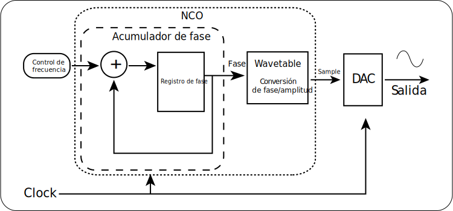

# Síntesis digital directa - ESP32

Voy a partir dejando en claro que el objetivo inicial de este proyecto era aprovechar el DAC de 8 bits del ESP32 para construir un oscilador digital.

La idea es utilizar este oscilador como núcleo dentro de un proyecto más grande relacionado con síntesis de sonido. Pero claro, a medida que se profundiza en el concepto de la síntesis digital directa (DDS en inglés), queda claro que el tema merece una buena explicación, ya que puede ser útil para cualquiera que quiera implementar su propio oscilador digital.

De todas formas si alguien quiere implementar un oscilador de forma rápida y tiene un ESP32, siéntase libre de copiar y pegar el código que esta en el fichero DDS de este repositorio. El código implementa un sintetizador digital directo en la ESP32, que permite entregar 4 tipos de onda distintos, senoidal, triangular, sierra y cuadrada, a travéz del DAC del pin 25. Las formas de onda son intercambiables mediante un pulsador. Que debe ser conectado entre 3.3V y el pin 33. Sientanse libres de utilizar los pines que les acomode y de cambiar este código de acuerdo a lo que estimen necesario, si buscan detalles sobre el funcionamiento del código hay una sección más adelante dedicada a ello. Sin mas retrasos, comenzaré ahora con la explicación completa.

## Entendiendo la oscilación

Para empezar con el tema de DDS, primero que nada debemos entender que es una oscilación. Si nos robamos una cita del libro "Fisica conceptual" de Paul G. Hewitt tenemos que:

> En un sentido general, todo lo que se mueve de ida y vuelta, atrás y adelante, de lado
a lado, adentro y afuera, o arriba y abajo, está vibrando. Una vibración es un meneo periódico en el tiempo. Un meneo periódico tanto en el espacio como en el tiempo es una onda.

Bueno, vibración = oscilación, y partiendo desde la primicia de que lo que buscamos generar con un oscilador es básicamente una onda de voltaje (la cual más adelante, mediante algún altavoz, esperamos poder transformar en una onda de presión para producir sonido) lo que debemos hacer es producir valores de voltaje con el DAC que varíen en el tiempo de la misma forma en que queremos que varíe la presión del aire. Simple.

La verdad, no tanto, pero todo a su debido tiempo. Partiremos hablando primero de como es que representamos estas oscilaciones.

## Amplitud y fase

Si han tenido cursos de física decentes puede skipear esta parte, pero de todas formas debo explicarlo para que quede bien claro.

Cuando representamos una oscilación básicamente lo que queremos representar es ese "movimiento" o "variación" de la "cantidad" en el tiempo. Para este fin llamaremos **"amplitud"** al valor de dicha cantidad, y **"fase"** a la situación instantánea del **ciclo** , respecto al punto de referencia.

Bien, vamos a explicar más detalladamente esto de la fase. Cuando tenemos una oscilación, existe un punto, al cual llamamos "referencia" que es básicamente el punto de equilibrio respecto al cual varía la amplitud. De esta forma podemos decir que un "ciclo", es el recorrido que representa ese movimiento de vaivén de la oscilación, y que su **"periodo"** es **cuanto tarda la onda en realizar aquel movimiento.** Ahora, como este movimiento es periódico, osea que se repite, se nos hace más "visual" representarlo como un punto recorriendo una circunferencia, de esta forma la "onda" que se genera, será la representación del valor de amplitud correspondiente a la posicion vertical dicho punto a medida que recorremos el círculo.

A partir de esto es que podemos decir, que la posición del punto, a lo largo de la trayectoriam representa la **fase**, "en que posición se encuentra la onda a lo largo del ciclo", y como dicho ciclo es representado en la circunferencia, su posición PUEDE ser representada por el ángulo entre la posición actual de la oscilación y el punto de referencia. A partir de esto, es que podemos ver que realmente, el valor de la amplitud de dicha onda, es una función de la **fase** la cual varía de forma constante en función al tiempo.

Espero que con esto haya quedado claro el tema de la fase (sino, pueden revisar el concepto de **"fasor"** en algún libro de física). Sin embargo aún queda hablar de otra propiedad importante de las ondas, la cual es la frecuencia.
Esta propiedad puede ser definida como...
> ... la medida del número de veces que se repite la oscilación en cierto instante de tiempo.

Básicamente esta propiedad nos dice que tan rápido ocurre el movimiento de vaivén, el cual según hablamos anteriormente estaba representado por el recorrido del punto, a lo largo de la circunferencia.

Bien......., dicho ya esto, es posible deducir, a partir de la representación anterior (y como spoiler se la sección siguiente) que:
>**Entre mayor es la frecuencia, más rápida es la oscilación, por lo tanto el punto que representa dicha oscilación debe recorrer la circunferencia más rápido.**

Nunca esta demás mencionar que la frecuencia es inversamente proporcional al **período** ya que entre más rápido realizamos el recorrido menos tiempo tardamos en él. Velocidad es igual a distancia sobre tiempo, un clásico.

Perfecto, ahora, no me detendré a explicar el comportamiento del sonido como una onda mecánica y blablabla. Para ello pueden visitar el capítulo 20 del Hewitt, citado anteriormente (realmente lo recomiendo, explica muchas cosas sin entrar en tecnicismos matemáticos muy complejos).

Pero es importante saber que el sonido es una onda mecánica, y que una de sus propiedades mas importantes (musicalmente hablando) es el tono o "pitch", y que este depende de la frecuencia, entre más agudo es el sonido más frecuencia tiene la onda y entre mas grave menos frecuencia, esto directamente ligado a las notas musicales (si, cada nota tiene su respectiva frecuencia). Por ello nos interesa que en en nuestro oscilador sea posible ajustar este parámetro, ya que de aquella forma nos permitirá crear melodías, y no solo patrones rítmicos.

## Osciladores digitales y wavetables

Ya, bien ahora que ya terminamos con la gran cantidad de texto relacionada con las ondas, ahora vamos a añadir otra necesaria, pero muy interesante cantidad de texto relacionada con las wavetables.

Básicamente la síntesis por wavetable es una técnica de síntesis que permite generar sonidos, a partir de una, **wavetable**.

¿Y que es una wavetable?, bueno, es básicamente un arreglo, de ondas, que poseen una forma similar, PERO, distinto contenido armónico.
Es literalmente un arreglo (o array para los amigos) tridimensional que almacena dos valores. Amplitud (para un ciclo de onda) y un elemento que nos dice cual de las ondas con "distinto contenido armónico" hay que reproducir.

Es efectivamente un array de dos dimensiones. Pero con una particularidad. Para graficar una oscilación necesitamos dos elementos, fase y amplitud. Bueno nuestro array contiene "amplitud" e "índice de onda", ¿de donde sacamos la fase?. Como la wavetable almacena valores de amplitud para **un sólo ciclo de onda** podemos utilizar el valor del índice de dichas amplitudes como valores de fase, claro no estarán en ángulos, como acostumbramos a ver, pero si representará en que estado se encuentra la oscilación dentro del su propio ciclo, diciéndonos en que "sample" o en que "punto" del circulo nos encontramos.

Con todo esto dicho, ahora nos hace un poco más de sentido la clásica vista tridimensional que poseen los osciladores en los sintetizadores de wavetable como Serum y Vital. Básicamente graficamos, los valores de amplitud, su correspondiente índice y el índice de onda.

Lindo, peeeeero, ¿y el sonido? Bueno, los valores de la amplitud en tabla anterior en realidad son muestras (samples, para los amigos) de dicha onda, lo único que tenemos que hacer para obtener sonido a partir de ellos, es cargar la wavetable en memoria, escribir un pequeño código que nos permita seleccionar cual onda con distinto contenido armónico queremos, y comenzar a reproducir los valores de la amplitud en función a su índice (fase).

*DISCLAIMER: para que la explicación sea más fácil utilizaremos wavetables con una sola dimensión, vamos a eliminar el índice de onda, de forma que cada wavetable solo posee 1 forma de onda disponible. Básicamente será un **vector** que almacena los datos de amplitud.*
*A modo de tabla, la wavetable se vería como.*

Índice |Amplitud |
---|---|
   0| 5   |
   1|  10 |
   2|   5 |

Bueno ahora, imaginemos que tengo una tabla, como la de arriba, con los valores de amplitud y fase, que representan **un ciclo** de una onda senoidal. para reproducirla, bastaría con lo dicho anteriormente, solo hay que recorrer la columna de fase, y reproducir su respectiva amplitud.

Para hacer esto necesitaremos, primero que nada la wavetable, un contador llamado **adress pointer**, que representará el índice al cual consultaremos para extraer su correspondiente amplitud, y una tercera variable, llamada **incremento de fase**, la cual nos dará el valor del **adress pointer** para obtener una frecuencia determinada. ¿Qué? Bueno, volvamos al circulo.

En el caso de nuestra querida wavetable, la circunferencia que representa el ciclo, es discreta, por lo tanto es un grupo de puntos finitos que representan cada uno de los samples que componen la onda. Para recorrerla, basta con moverse por cada uno de ellos, es decir el **adress pointer** debe tomar el valor de **fase** correspondiente a cada uno de esos puntos. Ahora, ¿recuerdan el spoiler de la sección anterior? Si yo quisiera una mayor frecuencia, necesito recorrer la circunferencia más rápido. Por lo tanto, lo que puedo hacer es "saltarme" una determinada cantidad de puntos, es decir, en vez de incrementar mi contador de 1 en 1, lo hago de 10 en 10, o de 15 en 15, de esta forma puedo recorrer mas rápido la circunferencia y aumentar la frecuencia. Entonces, el diagrama de bloques, de la solución que hemos encontrado para reproducir la wavetable se vería así.

Seguro algún chistoso se preguntó si hay una forma de disminuir la frecuencia, y la verdad es que si, pero conlleva un problema serio.
Cuando trabajamos con sistemas digitales, sabemos, supongo que todos, que un dicho digital realiza sus "actividades" de acuerdo a una señal de reloj, que de hecho esta en el diagrama. Bueno, por cada "tick" del reloj, nuestro computador (microcontrolador, microprocesador, lo que sea), actualizará el valor del **adress pointer** de acuerdo al **incremento de fase**. El valor mínimo para el incremento de fase es 1. Ya que el paso mínimo para recorrer el circulo es un punto a la vez. Por lo tanto la frecuencia mínima a la que podemos reproducir la onda es la frecuencia del reloj. Si quieren menor frecuencia, deben cambiar el reloj (cosa que si es posible con preescalers y blablabla, pero es poco práctico). Además esto deja en evidencia que todas las frecuencias que nos es posible reproducir, serán múltiplos de la frecuencia de dicho reloj.

Como resumen, este método funciona, pero nos limita en el rango de frecuencias que podemos alcanzar, además recorrer el circulo en pasos muy grandes significa que por cada ciclo, vamos a entregar menos samples y por lo tanto el aliasing rápidamente se tornará en un problema serio.

## Síntesis digital directa

Bien, para solucionar esto vamos a implementar finalmente, la Síntesis Digital Directa (DDS por siglas en ingles). Un esquema básico de esté método se compone de, un "control de frecuencia", un oscilador controlado numéricamente (NCO por siglas en inglés) y el convertidor digital-analógico (DAC por siglas en inglés). Ahora hablaremos de que hace cada uno.

### Control de frecuencia

Alguno eruditos lo llaman "registro de control de frecuencia" o cosas más sofisticadas, básicamente, en este "bloque", lo que hacemos es calcular el "incremento de fase", que ya dejaremos de llamar así, y comenzaremos a llamarlo **tuning word** y lo representaremos con la letra **M**.

Básicamente lo que hacemos en este bloque es resolver la siguiente ecuación:

$$ M =\frac{F_{salida} 2^{N}}{F_{CLK}}$$

De esta forma calculamos el valor adecuado para M que nos entregue la frecuencia de salida, $F_{salida}$ deseada. Siendo conocidos el valor de la frecuencia de reloj, $F_{CLK}$ y el valor de $N$, del cual hablaremos más adelante.

### Oscilador controlado numéricamente (NCO)

Un NCO como bien lo dice su nombre es un oscilador, pero, cuya frecuencia es controlada a través de un valor numérico, representado por la **tuning word**. El núcleo de este proceso es un elemento denominado **registro de fase** o **acumulador de fase**, el cual cumple un papel similar al **adress pointer** que utilizamos en el punto anterior, sin embargo en el caso del **adress pointer** este era una variable que tomaba valores en un rango entre el índice de los primeros y últimos elemento de la wavetable. Me explico, para una wavetable de 200 elementos, el adress pointer toma valores en un rango entre 0 y 199 (200 posible valores).

La diferencia entre el **adress pointer** y el **registro de fase** es, el tamaño de dicha variable, el registro de fase es considerablemente mas grande, ¿pero porque?. Bueno, para eso vamos a calcular la resolución de nuestro NCO, que corresponde al rango de frecuencias que podemos obtener a partir de él.

$$Resolución = \frac{F_{CLK}}{2^{N}}$$

Dicha resolución, depende de la frecuencia del reloj y de $2^{N}$ donde N corresponde al número de bits, del acumulador. Esto nos dice que entre mayor sea el número de bits del acumulador tendremos una mejor resolución de frecuencias, es decir, podremos variar la frecuencia más precisamente. De esta forma es que para los acumuladores de fase se utilizan comúnmente valores de 32 o incluso 64 bits.
Además esta enorme cantidad de bits nos permite alcanzar frecuencias muy bajas, ¿Porque? Responde esta pregunta ¿Cuanto se tardaría un contador con un reloj, de por ejemplo 100kHz en contar desde 0 a $2^{N}-1$ con N = 32? Más o menos medio día. (Esto tardaría en resetear la cuenta un acumulador de 32 bits, con M = 1, en otras palabras, esto tardaría en realizar un ciclo de onda!!). Entonces, esto nos lleva a pensar que para obtener frecuencias razonables (para obtener sonido), el valor de M deberá ser relativamente grande.

El segundo elemento importante del NCO es un conversor de "fase a amplitud" que es literal, un elemento capaz de transformar los valores de fase entregados por el acumulador, a valores de amplitud, que podamos mas adelante reproducir mediante un DAC. Si no les suena conocido, ese trabajo ya lo realizamos anteriormente con el adress pointer y la wavetable. Pero claro, ¿como vamos a acceder a los elementos de la wavetable, si ahora el acumulador tiene $2^{N}$ números?, tendríamos que tener una wavetable con la misma cantidad de samples. No necesariamente. Usualmente en este caso hay un "hack" que podemos aplicar para que los bits que utilicemos al acceder a la wavetable, los que utilizaremos a modo de **adress pointer**, sean solo una fracción de los bits utilizados en el acumulador.

En este caso, la cantidad de bits que necesitamos para el **adress pointer** corresponden a los necesarios para indexar los samples de nuestra wavetable. Para ejemplificar esto, vamos a considerar una wavetable de 8 bits, esto corresponde a una wavetable con 256 valores de amplitudes entre 0 y 255. Y un acumulador de fase con N = 32, es decir con 32 bits. Con esto en cuenta, necesitamos 8 bits, para indexar los 255 elementos, por lo tanto de los 32 bits de nuestro acumulador de fase, solo utilizaremos los 8 primeros bits y truncaremos el resto. ¿Por qué?

Porque este pequeño "hack" nos permitirá mantener la ventajas del acumulador de fase de 32 bits, pero indexar adecuadamente los valores de fase en la wavetable, sin comprometer la cuenta. Para ilustrar esto consideraremos un ejemplo aún más práctico.

Para un acumulador de fase con 8 bits, y una wavetable con 4 valores, 2 bits. Solo necesitamos 2 bits de los 8 para indexar, así que llamaremos **P** (de "pointer") a los 2 primeros bits del acumulador, al momento de indexar (es decir, al acceder al wavetable), solo vamos a considerar los dos primero bits y el resto serán truncados. También supongamos que aumentamos la cuenta en valores de 30 en 30 (M = 30), en binario sería *0001 1110* así que vamos a contar unas cuantas veces.

Iteraciones|Acumulador  | P | índice |
---|  ---| ---| ---|
1|  0001 1110 | 00 | 0 |
2|  0011 1100 | 00 | 0 |
3|  0101 1010 | 01 | 1 |
4|  0111 1000 | 01 | 1 |
3|  1001 0110 | 10 | 2 |

Como podemos ver en la tabla, el índice de la wavetable no cambia con cada cuenta, sino que cambia solo cada vez que cambian los dos primeros bits del acumulador (que son los que utilizamos para indexar), sin embargo nuestro acumulador sigue contando con los 8 bits que le corresponden ¿por qué? Porque como solo estamos "truncando" esos bits para indexar, lo que hacemos es contar a travez de un circulo con $2^{N}$ puntos pero solamente enviar un sample distinto cada vez que cambian los bits de P. 

Podremos hacer una analogía con el circulo de samples, podemos decir que tendremos un círculo con P puntos, que serán los samples, pero que contaremos a travéz de $2^{N}$ puntos que estarán repartidos a lo largo del circulo (puntos en negro), cada vez que nuestra cuenta sobrepase un circulo blanco, en el diagrama, se imprimirá dicho sample a travéz del DAC.

De esta forma podemos indexar nuestra wavetable sin tener que utilizar directamente los valores del acumulador de fase. Y además evitamos saltarnos tantos samples a medida que aumentamos la frecuencia disminuyendo esto, el "ruido por error de fase".

---

## Implementación

Finalmente vamos a implementar esto en código. Así que básicamente implementaremos un NCO en el ESP32 y utilizaremos el DAC de 8 bits del para entregar la señal analógica.

### Wavetable

Para la wavetable tomaremos unas consideraciones, como utilizaremos el DAC de  8 bits, los valores de amplitud que guardaremos en esta, tendran un rango entre 0 y 255. Además esta contendrá 256 samples. Hice un pequeño script en python para crear wavetables correspondientes a las formas de onda senoidal, triangular, sierra y cuadrada. Este código esta en la sección "Tables" del repositorio.

### Adress pointer y el acumulador

Como el acumulador de fase contendrá 32 bits (N = 32), vamos a utilizar los primero 8 para indexar la wavetable. Por lo tanto P = 8.

### Timer interrupt

Bien, ya estamos casi, solo hay que considerar un ultimo elemento, el clock. Como es descrito en el diagrama, el clock rige tanto la tasa de aumento del acumulador de fase (básicamente le dice cuando "contar") y la salida del DAC (básicamente le dice cuando debe entregar un valor de amplitud diferente). De forma que es bastante importante que tengamos conocimiento de dicha frecuencia, y que además esta nos dé el tiempo necesario para que podamos realizar la ejecución del programa.

Para esto utilizaremos un timer, que es básicamente un periférico que viene integrado en muchos microcontroladores. En este caso el ESP32 cuenta con 4 timers. Nosotros utilizaremos solo uno. Y lo programaremos para realizar una interrupción con una frecuencia de 100 kHz, esta frecuencia nos permitirá entregar valores entre 20 y 20kHz sin problemas.

#### ISR

Vamos a hablar un poquito sobre las ISR, rutina de servicio de interrupción por sus siglas en inglés o llamadas también como "controlador de interrupción" (interrupt handler), es básicamente una función especial, un bloque de código que se ejecuta en medio de una interrupción. La interrupción es básicamente un evento en el que el procesador "detiene" lo que sea que este haciendo, y realiza una acción. Dicha acción o función estará dentro de la ISR, o más bien, como la ISR es una función, dicha función ES la ISR. Por esto mismo, la regla más importante de la ISR, es que como esta "pausa el programa" para su ejecución, debe ejecutarse lo más rápido posible (como dato a parte, por esto es que esta se almacena en la RAM), por lo tanto debemos evitar la mayor cantidad de código extra dentro de ella. SOLO LO NECESARIO. (La verdad es que depende del proyecto, pero es bueno apegarse a esta regla).
De esta forma, en la ISR escribiremos el código necesario para aumentar el acumulador de fase y para escribir un valor de amplitud en el DAC.

---

### Código

#### Interrupción

Bueno el código esta en el fichero "dds" del repositorio, pero voy a explicar ciertas partes importantes.
Primero que nada decir que los valores obtenidos para las waveables están escritos en un header que también esta adjunto en el fichero dds. Ahora quiero explicar como setear la interrupción del timer.

Primero, escribimos en las declaraciones (arriba del setup() y el loop()) lo siguiente:

    hw_timer_t *My_timer = NULL;
    portMUX_TYPE mux = portMUX_INITIALIZER_UNLOCKED;

Y posteriormente en el setup() escribimos:

    My_timer = timerBegin(0, 80, true);

En esta linea creamos un objeto timer, al que llamamos "My_timer", mediante `timerBegin(0, 80, true)`, en donde el primer argumento representa cual timer utilizaremos, el ESP32 cuenta con 4 timers así que debemos selecciona uno de ellos con los números desde el 0 al 3. El segundo argumento en es "preescaler", para entenderlo debemos saber que los timers tienen una frecuencia base, en nuestro caso es de 80MHz, si MEGA, así que para obtener una frecuencia mas razonable utilizaremos el "preescaler", que es básicamente, una cantidad que "divide" la frecuencia base del timer, utilizaremos el valore de 80, ya que al dividir la frecuencia base de 80MHz en 80, obtenemos un conteo de 1MHz. Finalmente, el tercer argumento es una variable que le indica al timer si contar "hacia arriba" o hacia "abajo".

Ahora seguido a la linea anterior escribimos:

    timerAttachInterrupt(My_timer, &onTimer, true);

Lo que hacemos en esta linea es "añadirle" una interrupción al timer (My_timer), esta interrupción será la ISR que crearemos y la llamaremos onTimer(), por eso el segundo argumento de la función y finalmente el tercer argumento indica que tipo de interrupción será activada mediante "edge trigger" o "level trigger" (no me detendré a explicar esto, pero si tienen dudas pueden buscarlo fácilmente en google).

Siguiente, debemos añadir una alarma al timer, ¿que es esto?, es básicamente un "flag" que entrega el timer diciendo "debe realizarse la interrupción", este consta de 3 argumentos: el primero es el timer obviamente (My_timer). El segundo, representa cada cuanto tiempo debemos realizar la interrupción (en microsegundos), este número cambia de acuerdo al preescaler establecido, en este caso cada 10 microsegundos obtendremos la frecuencia establecida de 100kHz. El tercer argumento, finalmente, nos dice que una vez activada la alarma, debemos resetear la cuenta del timer. Y además debemos activar la alarma con la función `timerAlarmEnable(My_timer)`.

    timerAlarmWrite(My_timer,10, true);
    timerAlarmEnable(My_timer); 

#### NCO

El NCO lo implementaremos en la ISR, para esto declaramos las variables necesarias. En las primeras lineas calculamos la **tuning word** y abajo declaramos las variables para el **acumulador de fase** y el **adress pointer**.

      //Variables para el dds
    uint32_t f = 5000;
    uint32_t M = f*(pow(2,32))/100000;

      //contadores
    uint32_t acumuladorFASE = 0x00000000;
    uint8_t  addressPOINTER = 0x00;

Después creamos la ISR, como nota, todas las ISR creadas en la ESP32 utilizar el prefijo IRAM_ATTR, asi que quedaría de esta forma:

      void IRAM_ATTR onTimer(){
      acumuladorFASE = acumuladorFASE + M;
      addressPOINTER = acumuladorFASE >> 24; //Shiftear los bits

      // Condiciones para el cambio de onda
      if (count ==0)
      {
         dacWrite(25, SINE[addressPOINTER]);
      }
      if (count ==1)
      {
         dacWrite(25, SAW[addressPOINTER]);
      }
      if (count ==2)
      {
         dacWrite(25, TRIANGLE[addressPOINTER]);
      }
      if (count ==3)
      {
         dacWrite(25, SQUARE[addressPOINTER]);
      }
      }

Si se dan cuenta, en la tercera linea shifteamos los bits para poder indexar la wavetable.
Además hay ciertas condiciones nombradas más abajo (si parece que rompí un poco la regla de "sólo lo necesario" en la ISR, pero como vemos,la ejecución de este código no afecta mucho al programa). ¿Para que son? (se que hay mejores formas de hacer esto, pero esta es bastante visual) básicamente, estas condiciones son utilizadas para cambiar de onda en medio de la ejecución del programa. Esto a través de un contador que va entre 0 y 3 (tenemos 4 formas de onda), el cual aumenta cada vez que pulsamos un determinado botón.

Ahora para cambiar la onda, ya dije que utilizábamos un contador que aumenta con un botón, PERO, esto nos servirá para explicar otro tipo de interrupción.

Anteriormente creamos una interrupción que depende de un timer, ahora crearemos una que depende de un pin, en resumidas cuentas, al accionar un pulsador conectado a un pin, la lectura de dicho pin triggeará la interrupción. Para esto escribimos:

      pinMode(BUTTON, INPUT_PULLDOWN);
      attachInterrupt(BUTTON, selector, FALLING);

Así de sencillo, iniciamos el pin en la primera línea, y luego lo conectamos a la interrupción `selector()`, el tercer argumento nos dice si debemos accionar la interrupción cuando el pin está `HIGH`,`LOW)`,`RISING)` o `FALLING`. Ahí depende del tipo de botón conectado y blablabla, yo utilicé `FALLING` por comodidad.

Ahora la ISR del selector:

      void IRAM_ATTR selector(){
         buttonTIME = millis();
      //Condicion para el debounce
      if (buttonTIME - lastBTIME > 250)
      {
         //Aumento del contador
         if (count == 3) {
            count = 0;
         }
         else {
            count = count + 1;
         }

      lastBTIME = buttonTIME;
      }
      }

Vemos que hay unas condiciones internas que aumentan la cuenta del selector, pero hay una externa que realiza mediciones de tiempo con la funcion `millis()`, ¿para que es esto? básicamente para evitar uno de los problemas más comunes de la interrupciones controladas por pulsadores, el "bouncing", que es básicamente cuando el micro lee erróneamente el accionamiento del pulsador e incrementa la cuenta en valores adicionales. Puedes ver que pulsaste una vez el botón pero tu cuenta aumentó en 2 y no en 1 como debería. Bueno esto es porque el micro lee tan rápido las entradas de los pines que no alcanzas a soltar el botón antes de que vuelva a leer, y así lee como si lo hubieses accionado dos veces. Con esa condición externa, lo que hacemos es aplicar un "debouncing", que básicamente sólo permite que la función de "aumento" sea ejecutada cuando las pulsaciones se encuentran fuera de un rango mínimo de tiempo, para eso utilizamos `millis()`, básicamente le decimos que puede leer el botón sólo una vez cada cierto tiempo, en este caso 250 milisegundos.

Y bueno con todo esto el código final sería:

      //Codigo de prueba para DDS 
      #include "wavetables.h"
      //Definiciones----------------------------------
      #define BUTTON 33
      hw_timer_t *My_timer = NULL;
      portMUX_TYPE mux = portMUX_INITIALIZER_UNLOCKED;
      volatile int count =0; 
      unsigned long buttonTIME = 0;  
      unsigned long lastBTIME = 0; 

         //Variables para el dds
      uint32_t f = 5000;
      uint32_t M = f*(pow(2,32))/100000;

         //contadores
      uint32_t acumuladorFASE = 0x00000000;
      uint8_t  addressPOINTER = 0x00;

      //escribir la ISR del DSS----------------------------
      void IRAM_ATTR onTimer(){
      acumuladorFASE = acumuladorFASE + M;
      addressPOINTER = acumuladorFASE >> 24; //Shiftear los bits

      // Condiciones para el cambio de onda
      if (count ==0)
      {
         dacWrite(25, SINE[addressPOINTER]);
      }
      if (count ==1)
      {
         dacWrite(25, SAW[addressPOINTER]);
      }
      if (count ==2)
      {
         dacWrite(25, TRIANGLE[addressPOINTER]);
      }
      if (count ==3)
      {
         dacWrite(25, SQUARE[addressPOINTER]);
      }
      }

      //ISR del selector
      void IRAM_ATTR selector(){
         buttonTIME = millis();
      //Condicion para el debounce
      if (buttonTIME - lastBTIME > 250)
      {
         //Aumento del contador
         if (count == 3) {
            count = 0;
         }
         else {
            count = count + 1;
         }

      lastBTIME = buttonTIME;
      }
      }

      void setup() {

      //setup del timer a 100 kHz

      My_timer = timerBegin(0, 80, true);
      timerAttachInterrupt(My_timer, &onTimer, true);
      timerAlarmWrite(My_timer,10, true);
      timerAlarmEnable(My_timer); 

      //interrupcion para el el switcheo
      pinMode(BUTTON, INPUT_PULLDOWN);
      attachInterrupt(BUTTON, selector, FALLING);
      }

      void loop() {
         //No hay nada corriendo en el loop
      }

Si se dan cuenta el loop queda vacío ya que toda la ejecución del NCO es realizada en las ISR.

## Conclusión

Espero que se haya entendido al menos mi explicación, y que si alguien ha llegado hasta acá sin tener muchos conocimientos de esto, al menos pueda rescatar algo, intenté cubrir todos los puntos que yo, al intentar llevar a cabo este proyecto no tenía muy claros. Si hay algún error conceptual en la explicación o cualquier otro tipo de error, les agradecería hacérmelo saber, todo sea en pos del conocimiento.

Ahora si alguien quiere implementar esto en una tarjeta diferente, consideren que la salida del DAC puede reemplazarse con un PWM y un buen filtro, además es posible implementar esto en una placa Arduino sin DAC integrado, pueden construir uno con resistores y utilizar 8 pines simultáneamente, eso si, el setup de los timers cambia en cada controlador, pero bueno, eso ya es tarea para la casa.

Además no hablé de como cambiar las notas en medio de la ejecución, bueno como ya sabrán esto lo hacemos cambiando la **tuning word**, este trabajo no es para nada complicado, pueden usar un look up table, con los valores de M para cada nota musical y así evitar recalcular M cada vez que cambien de nota. Pero bueno como lo dije anteriormente, esto también es tarea para la casa.

Muchas gracias por su atención.

## Referencias y links interesantes

Hewitt, P. G. (1998). Física conceptual.

<https://www.weigu.lu/microcontroller/dds/index.html>

<https://www.youtube.com/watch?v=xiby-mkIgQ0&t=1212s>

<https://www.youtube.com/results?search_query=DDS+arduino>

<https://docs.espressif.com/projects/esp-idf/en/latest/esp32/api-reference/peripherals/gptimer.html>

<https://espressif-docs.readthedocs-hosted.com/projects/arduino-esp32/en/latest/api/timer.html>
